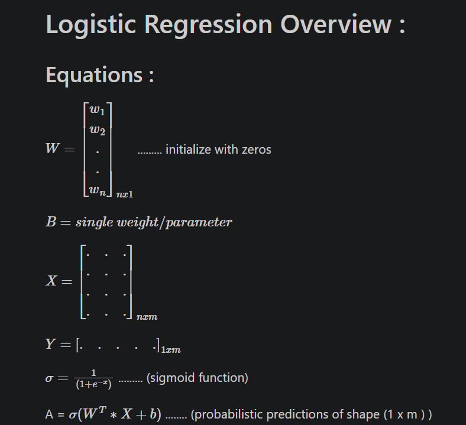
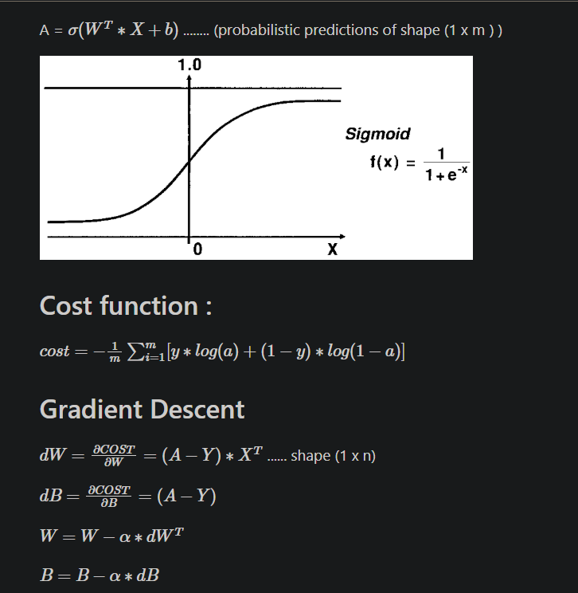
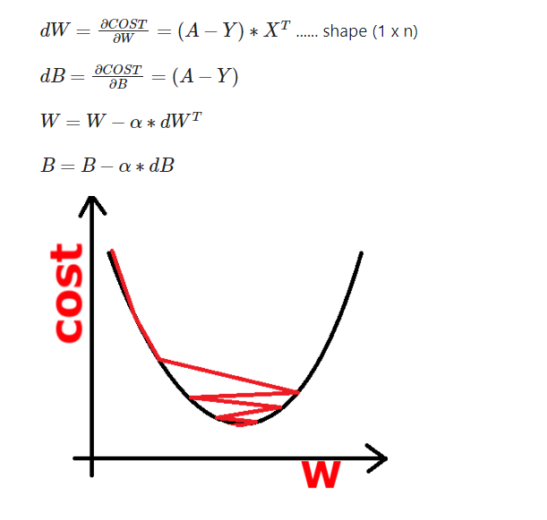

.values -> return numpy reprsentation of pandas dataframe

learning_rate = 0.0000015 -> 63 %
learning_rate = 0.000015 -> 65 %
learning_rate = 0.00015 -> 68%
learning_rate = 0.00025 -> 69% 
learning_rate = 0.00027 -> 70%

80%
iterations = 10000000
learning_rate = 0.00027

